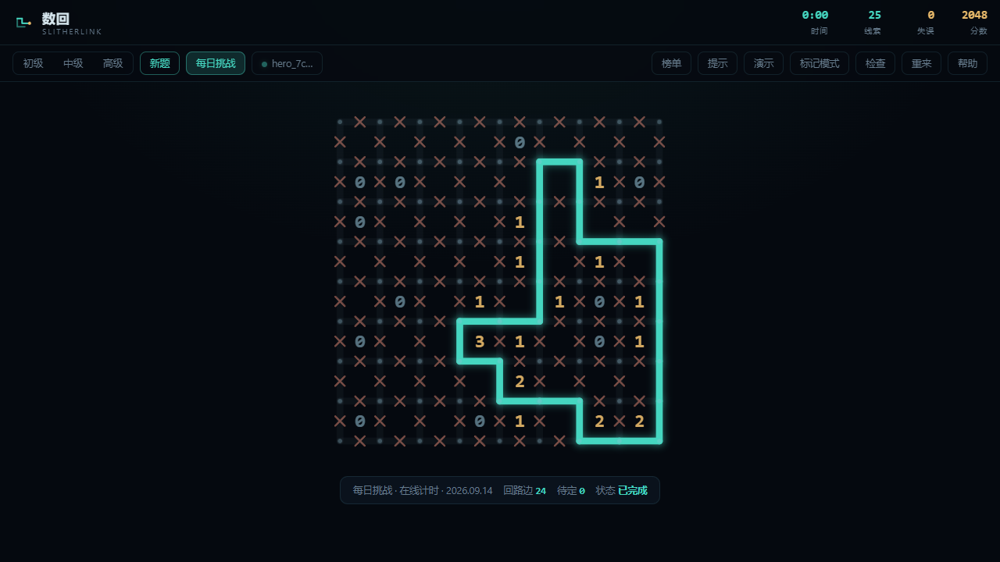
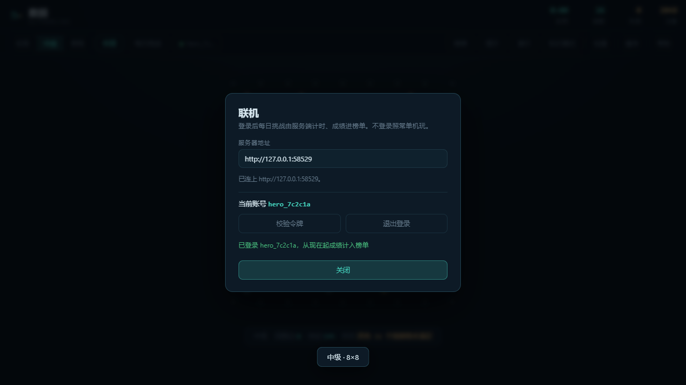
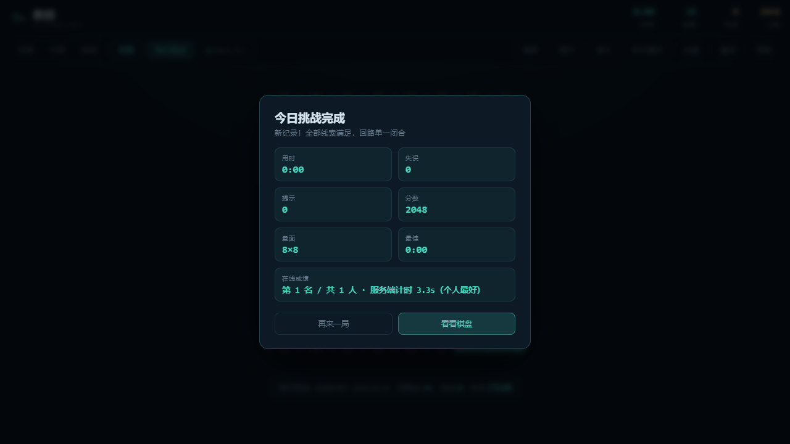

# 数回 · Slitherlink


一个零依赖的单文件网页游戏。沿点阵的格线连出一条**单一闭合回路**——不分叉、不交叉、不断头；
格子里写着几，就说明这个格子的四条边里有几条属于回路。

双击 `index.html` 就能玩，不需要服务器、不需要联网、不需要安装任何东西。

```
数回  SHUHUI / SLITHERLINK
```



它还**可以**联机：注册一个账号，每日挑战由服务端统一计时、成绩进实时排行榜。
但这是加成不是前提——没网、没登录、后端没起，任何一样都只是让榜单消失，
棋盘照常能玩。这一点在代码里是有意为之的，不是巧合。

| 怎么打开 | 每日挑战 | 排行榜 |
|---|---|---|
| 双击文件，没后端 | 本地按日期定种子 | 无 |
| 网页托管，未登录 | 同一天全球同一道题，本地计时 | 可看，不上榜 |
| 登录后 | 服务端计时 | 实时上榜（WebSocket 推送） |

## 玩法

- **画线**：点击一条边，或按住拖动连续画
- **排除**：右键点击（触屏开「标记模式」），标出确定不在回路上的边
- **擦除**：在已画的边上再点一次
- 快捷键 <kbd>N</kbd> 新题 · <kbd>H</kbd> 提示 · <kbd>D</kbd> 演示 · <kbd>C</kbd> 检查 · <kbd>R</kbd> 重来

三条能立刻上手的推理：

- **0 和 4**：0 表示四条边都不在回路上，4 表示四条边全在——先把这些格子圈出来。
- **3 挨着 0**：3 的格子被 0 挡掉共享的那条边后，剩下三条必须全画。
- **拐角不落单**：每个点要么没有线，要么恰好两条线。某个点已经连了两条，其余方向立刻排除；
  只剩一条出路时，那条必须画。

## 特色

- **每道题唯一解**：不是「大概能解」，而是出题时逐条挖空、每挖一条都用回溯求解器验证一次解仍然唯一；
  最后还会再做一次完整校验。挖到不能再挖为止，所以线索是精简的，但绝不含糊。
- **难度三档**：初级 6×6、中级 8×8、高级 10×10，线索保留比例逐档下降。
- **每日挑战**：按日期定种子，全服同一道题；记录当日最佳用时与累计次数，跨零点结算也不会记错天。
  接上后端则由服务端下发同一道题、由服务端计时，成绩实时进榜；连不上就退回上面这套本地逻辑。
- **提示是真的推理**：优先用约束传播找出「一定能推出来」的边；只有在推不动时才退化为试探，并明确告诉你。
- **演示**：自动逐步展示求解器怎么把边一条条定下来。
- **即时纠错**：画错或标错的边会闪一下红色并撤回，失误计入分数——不会让你在一个错的局面里越陷越深。
- **联机可选**：账号 / 服务端计时 / 排行榜 / WebSocket 实时推送。后端不可达时整块静默消失，不弹任何报错。
- 计时 / 计分 / 进度本地存档 / 移动端触控 / 窄屏适配。

## 联机模式

### 怎么连

页面上有个「联机」按钮，点开填服务器地址就行。地址的来源有三个，按优先级：

1. 打开页面时带 `?api=https://your-server` —— 顺便会记进 `localStorage`，下次自动连；
2. 「联机」面板里手填；
3. 页面 `<meta name="puzzle-api">` 里预设。

留空表示**同源**，适合把游戏和后端放在同一个域名下（后端自带一个极简大厅页，
也可以直接托管这个 `index.html`）。用 `file://` 打开时同源地址不可用，必须显式填后端地址——
这时浏览器按 `Origin: null` 发请求，后端开了 `Access-Control-Allow-Origin: *`，
用 Bearer 令牌而非 Cookie，所以能正常工作。

### 联机之后多了什么



- **账号**：`POST /auth/register` / `/auth/login`，拿一个 7 天有效的 JWT，存本地；
  连的是另一个后端时会自动把旧令牌丢掉（那是别人的令牌，留着只会得到一串 401）。
- **每日挑战**：题面由服务端下发，同一天全球同一道题。**题面里没有答案。**
- **服务端计时**：领题时服务端记下时刻，交卷时算差值，客户端上报的时间一律不采信。
  耗时低于 3 秒（疑似脚本）或超出 6 小时都不进榜单。
- **排行榜**：当日榜 + 历史总榜，存的是**个人最好成绩**——同一玩家多次交卷只留最快那次。
- **实时推送**：`/ws/leaderboard/shuhui`，连上先收一份快照，之后每次有人上榜收到新的完整快照。
  断线按指数退避重连。

服务端算出来的耗时和本地计时器是两回事，下面这张图里能同时看到：
本地计时器因为用测试脚本瞬间填完而停在 `0:00`，而结算行里的 `3.3s` 是服务端算的。




### 没有答案，怎么做到「画错当场闪红」

这是接入时最费斟酌的一处。离线玩法有个很好的手感：画错的边立刻闪红并撤回，失误计入分数。
但联机模式下服务端不下发答案——那正是防作弊的意义所在。

做法是**用引擎就地解一份**。题面是 8×8 的唯一解盘面，本地求解器跑一次通常 1~3 毫秒
（90 道题池里的题实测最慢 3ms，见 `tests/online.mjs` 里的比对）。这份本地解
只用来做即时反馈和「提示」；**真正的判定始终在服务端**，客户端说什么都不算数。

极端情况下本地解不出来（求解预算被爆），游戏不会因此瘫痪：
`S.sol` 为 `null`，即时纠错和提示自动关闭，棋盘照常能画，交卷仍由服务端判。

### 只报「哪些边在回路上」

交卷体是 `{"on": [13, 30, 31, ...]}` —— 一组边编号，顺序不限、允许重复。
服务端把它和答案的集合直接比对。这样端序、冗余、重复都影响不了判定，
而客户端的编码方式也就成了双方唯一的强耦合点，所以边编号约定写进了
`src/engine.js` 的注释里：`H(r,c) → r*n+c`，`V(r,c) → n*(n+1)+r*(n+1)+c`。

### 联机库从哪来

`src/puzzle-client.js` 是从本仓库 `server/web/puzzle-client.js`
**vendored** 过来的副本（内容逐字节相同）。

不选择运行时去后端拉一个 JS，是为了保住「单文件、零依赖」这条底线：
`file://` 下跨源加载会被浏览器拦掉，断网时更是直接白屏。代价是有可能漂移，
所以后端仓库里有个 `tools/sync_client.sh --check` 专门用来卡这一点，CI 里会跑。

## 技术要点

### 盘面编码

`n×n` 个格子、`(n+1)×(n+1)` 个点，盘面一共 `2n(n+1)` 条边。每条边只有三种状态：

```
UNKNOWN(-1) 未定   OFF(0) 确定不在回路上   ON(1) 确定在回路上
```

水平边 `H(r,c)` 与垂直边 `V(r,c)` 各自映射到一个整数编号，所有几何关系
（格的四条边、点的相邻边、边的两个端点、边的相邻格）在 `buildLayout()` 里一次性预计算成
`Int32Array`，求解时不再做任何除法取模。

### 约束传播

求解器不搜索，先把必然的东西推干净。三类规则：

1. **线索**：格 `(r,c)` 的四条边里 ON 的条数必须等于线索值。
   已经够了 → 其余全排除；还差几条而剩下的未定边刚好那么多 → 全部确定。
2. **度数**：每个点相邻边里 ON 的条数只能是 0 或 2。
   已经连了两条 → 其余全排除；已经连了一条而只剩一条未定 → 那条必须画。
   只连了一条且没有未定边，或者一条都没连而只剩一条可选 → 矛盾（会留下线头）。
3. **回路唯一性**：ON 边在度数约束下只能构成路径或环。
   出现两个环、或环之外还有别的 ON 边 → 矛盾；某条未定边两端已经连通，
   选了它就会闭出一个不含全部 ON 边的环 → 该边排除。

第 3 条是本项目里最容易写错、也最值得说的一处。最初写成「两端已连通就一律排除」，
结果**少数了一种解**：一个环的最后一条边恰好连接首尾两端时，它闭出的正是完整回路，
不该被排除。这个问题是被下面那套交叉验证抓出来的。

传播由队列驱动并增量更新，直到不动点；环路规则改动边之后会补一轮增量传播。

### 出题：从回路反推线索

方向是反的——先生成答案，再挖出题面。

1. **长出随机区域**：从随机起点做 4-连通随机生长，得到一个多连块。
2. **校验简单性**：要求该区域没有洞（补集在 `(n+2)×(n+2)` 的虚拟网格上仍从外部可达），
   且不存在 `2×2` 里恰好两个对角格都属于它的情形（那会让边界自我接触）。
   满足这两条，它的边界就是一条单一闭合回路。
3. **取边界** → 回路；再随机做若干次「局部翻拐」（`2×2` 的四个点若有 3 条边在回路上，
   换成剩下那条），这一步保持回路单一性，但让形状摆脱多连块的方正感。
4. **算出完整线索**，并先验证完整线索下解唯一——不唯一就换个形状。
5. **挖空**：按随机顺序尝试拿掉线索，每拿掉一批都跑一次求解器验证解仍然唯一，不唯一就放回去。
   一次试一批（默认 4 条）而不是一条，一批通过就省下 3 次验证；整批不过再退化成逐条试，
   保证不会因为图快而少挖。

### 解计数与预算

`countSolutions(L, clue, state, limit, budget)` 是深度优先搜索加传播剪枝：

- 一旦 ON 边组成单一闭合回路，其余边只能全部排除，解就唯一确定了，直接计数返回，不再往下搜；
- 计数到 `limit` 个（通常是 2）立刻停止——判断「是否唯一」不需要知道一共有几个解；
- `budget` 是搜索节点预算。个别盘面会让搜索爆炸（实测高级难度最坏一次验证要 7 秒），
  超出预算就放弃并标记 `aborted`，出题器据此把「拿不准」当成「不能挖」。
  宁可题目多留一点线索，也不能把界面卡住。加上这一条之后，10×10 出题最坏耗时从 7.2 秒降到 0.4 秒。

### 界面

纯 CSS Grid + SVG，零依赖单文件。`src/template.html` 提供骨架与样式，
`src/engine.js`、`src/puzzle-client.js` 与 `src/game.js` 由 `build.py` 各自包一层 IIFE 内联进去：
引擎把 API 挂到 `window.SH`，联机库把构造器挂到 `window.PuzzleClient`，界面再取用。

棋盘用 SVG 画：点阵是 `<circle>`，每条边是一次性建好的三个元素
（不可见但很粗的命中区 `<line>`、可见线 `<line>`、边中点的排除标记 `<path>`），
状态变化只改 class，不重建 DOM。拖动时用 `document.elementFromPoint` 定位当前边，
所以手指/鼠标快速划过也能连续画上。

## 目录结构

```
index.html                 游戏（构建产物，双击即玩）
build.py                   构建：内联 src/*.js 到 template.html
src/engine.js              引擎：盘面、传播、求解、出题（Node 与浏览器双端可用）
src/puzzle-client.js       联机库（vendored，源在 server/web/）
src/game.js                界面逻辑：渲染、交互、计时计分、存档、联机接线
src/template.html          骨架与样式
src/engine.test.mjs        引擎测试：18 组
tests/test.mjs             离线 UI 测试（Playwright 驱动 Chromium）：74 项
tests/online.mjs           联机端到端测试（真后端 + 两个玩家）：48 项
tests/chrome.mjs           Chrome 定位（环境变量 > Playwright 缓存 > 本机安装）
tests/shots/               测试顺带产出的截图，README 里用
```

## 运行测试

```bash
# 引擎（不需要浏览器）
node src/engine.test.mjs

# 离线 UI
cd tests
npm install          # 只装 playwright-core；若本机没有 Chrome/Chromium 还需 npx playwright install chromium
node test.mjs

# 联机端到端（会在本机起一个真后端）
node online.mjs
```

`tests/chrome.mjs` 会按 `CHROME_PATH` 环境变量 → Playwright 浏览器缓存 → 本机已安装 Chrome
的顺序找浏览器，所以换一台机器也能直接跑。

`online.mjs` 需要 Python 3（后端已内置在本仓库 `server/` 目录，它自己会拉起 uvicorn、
用临时 SQLite 灌好题池、再起一个静态服务把游戏页面发出去）。解释器按
`PYTHON` 环境变量 → 仓库内 `.venv` → 托管 venv 的顺序找；`SKIP_ONLINE=1` 可以跳过。

## 测试怎么保证它是对的

求解器不能自己证明自己，所以测试里另写了一个**完全独立、笨拙但绝对可信的暴力枚举器**：
它不碰引擎的求解与传播代码，只枚举全部格子子集、取边界、看哪些边界满足线索。
两个实现互为参照：

- `countSolutions` 的解数与暴力枚举**逐例比对**——320 组随机小题，全部一致（其中 195 组是多解的，
  这一点很关键：只比对「唯一解」的题目是测不出少数解的 bug 的）。
- `propagate` 的**每一个**推导都拿全部解来验——500 组题目、1794 个推导，
  凡是传播确定下来的边，在暴力枚举出的每一个解里都必须一致。
  这条正是前面那个「禁止闭合环写过头」的 bug 的照妖镜。
- `generate` 产出的每一道题：解必须是合法回路、必须满足全部线索、必须**恰好一个解**。

界面测试走的是真实浏览器里的真实鼠标：点击、右键、拖动画线、提示、演示、通关、刷新恢复、
窄屏布局，以及每日挑战的「同一天同题、不同天不同题」。

界面上专门有一类是**量渲染尺寸**而不是数节点：格子必须是正方形、棋盘区域必须是正方形、
数字必须有实际大小、每条边必须是水平或垂直的线段。只数节点是抓不到「棋盘塌成一条线」这类
问题的——元素一个不少，尺寸全是错的。

联机那部分另有一个真端到端测试（`tests/online.mjs`）：它拉起真的 uvicorn、真的 SQLite、
真的 WebSocket，然后让**两个独立玩家**同时玩同一道题 ——
- 玩家 A 是浏览器里的真界面，走「点按钮 → 填表单 → 注册 → 每日挑战 → 画完 → 看名次 → 开榜单」
  这条完整路径，中间不碰任何内部函数；
- 玩家 B 是 Node 里的**同一个客户端库**，只用来证明这个库不挑运行环境。

其中有一条断言是别的方式替代不了的：玩家 A 开着榜单页面不动，玩家 B 交卷，
A 的榜单必须**自己**多出一行。这是唯一能证明实时推送真的通了的东西 ——
查接口返回、查数据库都对，但页面上什么都没变的情况太常见了。

几条口径也是在这里钉死的：题面出参里不能含 `solution`；没领过题的人交卷会被判对但不上榜
（服务端按 0 耗时算，低于下限）；同一玩家交卷变慢时榜上保留的是最快那次。

反过来，离线那边也有一组"守门"断言：整轮测试跑在 `file://` 下，要求联机层
一声不吭——不报 console 错误、点「榜单」立刻给出可操作的提示而不是干等超时、
「每日挑战」照旧走本地出题并把状态栏标成「本地」。
加联机功能最容易犯的错就是让它在离线时变成负担，所以这条得由测试来钉。

## 规则出处

数回是 Nikoli 1989 年的原创谜题（Puzzle Communication Nikoli #26），
原名「スリザーリンク」，英文通常叫 Slitherlink，也叫 Fences、Loop the Loop。

## 姊妹项目

| 游戏 | 仓库 | 说明 |
|------|------|------|
| 数回 Slitherlink | `shuhui`（本仓库） | 一笔画闭环填边，唯一解保证 |
| [数织·奇想](https://github.com/yuanshne/shuzhi) | `shuzhi` | 经典/马赛克双玩法、每日挑战、16 幅像素画画廊、唯一解保证 |
| [立方数独 3D](https://github.com/yuanshne/shudu3d) | `shudu3d` | 魔方数独：转层分开重复数字，每面补成 1~N² 即胜 |
| [长夜灯](https://github.com/yuanshne/changyedeng) | `changyedeng` | 锈湖式文字解谜：荒山客栈里一盏吃名字的灯 |

数绘、数织、数独 3D 的联机后端各自内置在本仓库的 `server/` 目录里；长夜灯是纯单机叙事游戏，没有后端。

## 许可

MIT
